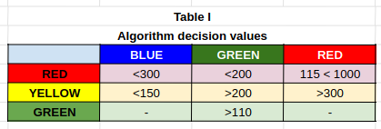
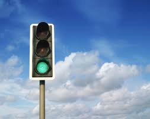
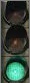
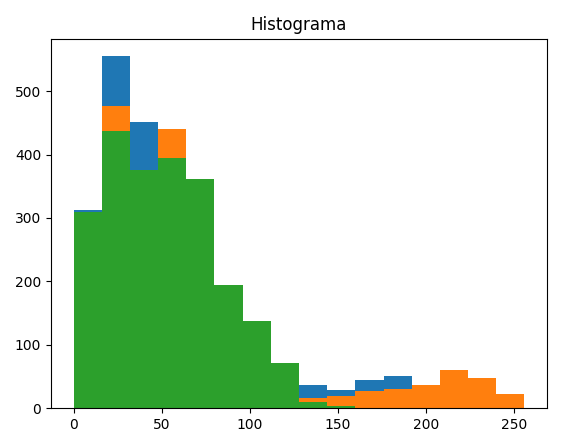
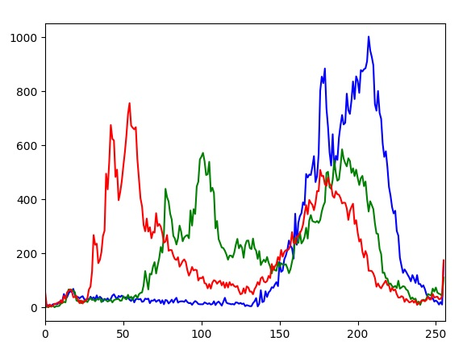
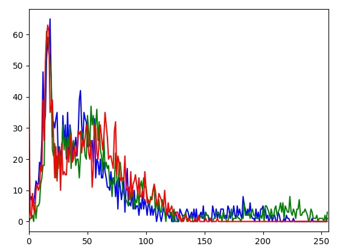
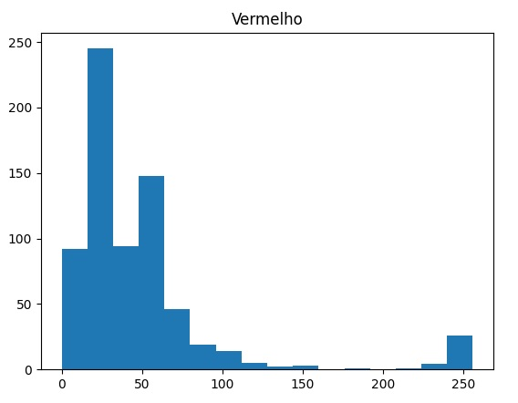
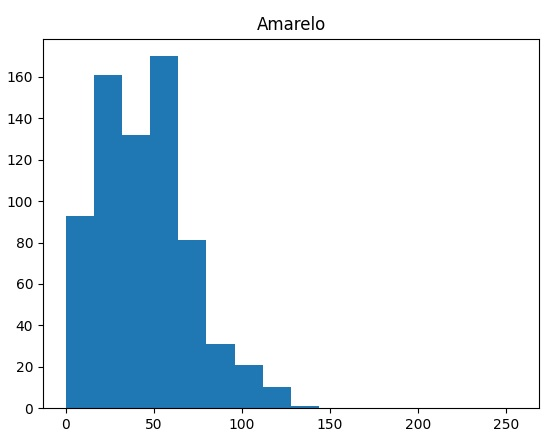
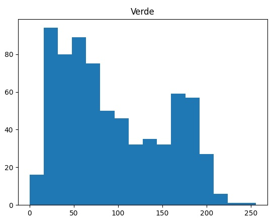

# opencv-TrafficLight
The aim of this mini project was to develop a program in opencv, which reads several images of traffic lights provided, and based on the analysis of the histogram of these images, detects whether the respective lights are on, namely green, red and yellow .

Software used:
OpenCv version 4.4.0, and the Python language in its 3.8 version, and the IDE used pycharm and Jupyter Notebook.

Operation:

The following libraries were imported: opencv which is specific for "computer vision", numpy, for the treatment and manipulation of matrices, and the matplotlib library for analysis and better visualization of histograms.

A for repetition structure was used to open each image, select the mask that highlights the corresponding traffic light and cut the image (lines 31 to 34), leaving only the traffic light for analysis. It then splits the three color channels (line 37).

The respective histograms were created for each channel (line 39 to 41). Histograms with 32 BINs were used because they were found to contain enough information for a correct color analysis. For this, the values ​​of each histogram (line 45 to 47) are added and analyzed.

In a first analysis only part of the spectrum was used, mainly between 20 and 32, as the lights on will have more values ​​in the higher spectra, but it was found to have the same result as an analysis in all 32 BINs.

Next, the analysis is carried out using decision structures, this algorithm detects whether the color is lit or not (lines 53 to 61). Taking into account that it is already known in advance that the green color does not trigger at the same time as the yellow color, and the green color values ​​can interfere with the yellow color, the analysis of the green color only triggers if the yellow color does not occur.
The colors activate according to the following values ​​in table I.

Example of image treatment "Semaforo_verd_1".

Original Image with the bounding box.

Image that will be treated by the algorithm, after applying the mask.

Histogram of 32 BINs of the three channels.

Model evaluation.

The algorithm has an accuracy of 89%, failing only in the image "Semaforo_verm_5", in the middle traffic light, because the yellow color has a high percentage of red and cannot carry out a correct analysis, and in the same image in the smallest traffic light, because the color green is too dar

The histograms could have been made in opencv as per hist.py.
Histogram of the original image in opencv.

Another approach.

As it is a fact acquired from the problem, the fact that the colors do not change their position on the traffic light, that is, the red light only lights up in the upper position, the yellow light in the central position and the green one in the lower position, we can analyze the traffic light in gray tone, just checking which light is on, through the intended tone.
This approach to the first image is in the main2.py file.

Conclusion

In this mini project I deepened my knowledge in opencv and in image processing, mainly in the analysis of images through their histograms, how to extract this data and use them for processing and analysis.